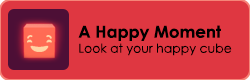

# 🎞️ DOTween Animation in Unity

## 🔄 Live Preview

Want to see it with better quality?

👉 [**Watch the full video on YouTube**](https://img.youtube.com/vi/nPS0jvMFvho/0.jpg)

## 💡 About the Project

This project explores the basics of animating GameObjects using DOTween. It includes examples of:

- Moving objects smoothly over time
- Changing colors and scales
- Chained animations and sequences
- Tweens triggered by user input

The goal is to understand how DOTween can simplify common animation tasks in Unity without needing to use Animation Clips or Animator Controllers.

## 🏆 Bonus Touch

A custom **Steam-style achievement popup** was also added for flair:

## 🛠️ Technologies Used

- **Unity Engine** – Game development environment  
- **C#** – Used for scripting animations  
- **DOTween** – Tweening engine for Unity by Demigiant  
